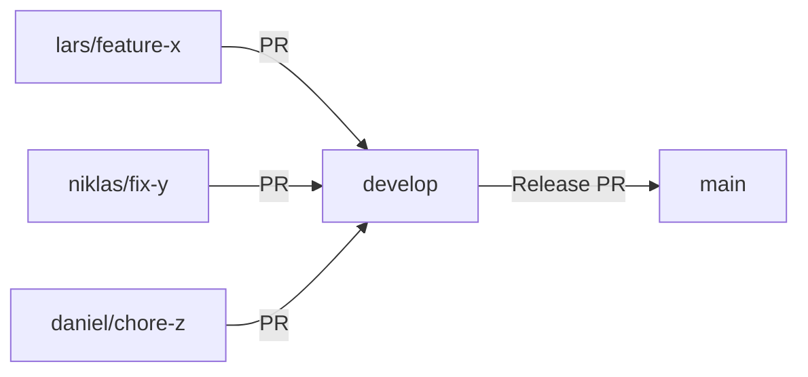

# Contributing to Winter Arc

Danke für dein Interesse an Winter Arc! Wir freuen uns über Beiträge. **Bitte lies zuerst [CLAUDE.md](CLAUDE.md)** – es ist unsere zentrale Quelle für Architecture, Patterns und Critical Guidelines. Dieses Dokument fasst die branch-spezifischen Regeln, PR-Workflows und Next.js-Patterns zusammen, die bereits in bestehenden Automationen (Husky Hooks, GitHub Actions) verankert sind.

---

## 🌳 Branch & Merge Konventionen

### Branch-Hierarchie

- **main**: Production Branch (geschützt, nur via PR von `develop`)
- **develop** (oder `dev`): Staging Branch (Integration Testing)
- **`<username>/<type>-<description>`**: Feature/Fix/Chore Branches

### ⚠️ Branch-Naming-Schema (PFLICHT)

**Alle Branches** (außer `main` und `develop`) **MÜSSEN** diesem Pattern folgen:

```
<username>/<type>-<description>
```

#### Gültige Types

| Type | Beschreibung | Beispiel |
|------|--------------|----------|
| `feature` | Neues Feature | `lars/feature-dashboard-refactor` |
| `fix` | Bug Fix | `niklas/fix-login-error` |
| `chore` | Maintenance (Deps, Config) | `daniel/chore-update-deps` |
| `refactor` | Code-Umstrukturierung | `john/refactor-api-layer` |
| `docs` | Dokumentation | `jane/docs-contributing` |
| `test` | Test-Änderungen | `lars/test-e2e-checkout` |
| `style` | UI/CSS-Änderungen | `niklas/style-button-hover` |

#### ✅ Gültige Beispiele

```bash
lars/feature-dashboard-refactor
niklas/fix-login-error
daniel/chore-update-dependencies
john/refactor-api-layer
jane/docs-contributing-guide
```

#### ❌ Ungültige Beispiele

```bash
feature/dashboard          # ❌ Fehlt Username
lars-feature-dashboard     # ❌ Fehlt Slash und Hyphen
lars/random-stuff          # ❌ Ungültiger Type
fix-login-bug              # ❌ Fehlt Username und Slash
```

### Automatische Validierung

Branches werden **automatisch validiert**:

1. **Lokal (Pre-push Hook)**: `.husky/pre-push`
   - Prüft Branch-Name **vor** dem Push
   - Blockt Push bei ungültigem Namen

2. **Remote (GitHub Actions)**: `.github/workflows/validate-branch.yml`
   - Prüft Branch-Name bei jedem Push
   - Scannt nach Legacy-Branches (ohne korrektes Format)
   - Validiert PR-Target (nur `develop` erlaubt)

3. **Branch Protection Rules**:
   - **main**: Keine direkten Pushes, nur via PR von `develop`
   - **develop**: PRs von Feature-Branches mit gültigem Namen

### Branch-Workflow

```bash
# 1. Aktualisiere develop Branch
git checkout develop
git pull origin develop

# 2. Erstelle neuen Branch mit KORREKTEM Namen
git checkout -b <dein-username>/<type>-<beschreibung>

# Beispiele:
git checkout -b lars/feature-training-mode
git checkout -b niklas/fix-streak-calculation
git checkout -b daniel/chore-eslint-config

# 3. Arbeite an deinem Feature (kleine, fokussierte Commits)
git add .
git commit -m "feat(scope): short description"

# 4. Pushe Branch und erstelle PR (Target: develop)
git push -u origin <dein-username>/<type>-<beschreibung>
gh pr create --base develop --title "..." --body "..."

# 5. Nach Merge: Branch löschen
git branch -d <dein-username>/<type>-<beschreibung>
```

### Branch umbenennen (falls falsch erstellt)

```bash
# Lokal umbenennen
git branch -m <alter-name> <username>/<type>-<beschreibung>

# Remote updaten (falls schon gepusht)
git push origin :<alter-name>  # Alten Branch löschen
git push -u origin <username>/<type>-<beschreibung>  # Neuen Branch pushen
```

### Merge-Flow



**Regel**:
- Feature/Fix/Chore → **develop** (immer)
- **develop** → **main** (nur für Releases, via Admin)

---

## 📝 Commit-Konventionen

Wir verwenden **Conventional Commits** für strukturierte Commit-Messages.

### Format

```
<type>(<scope>): <subject>

<body (optional)>

🤖 Generated with [Claude Code](https://claude.com/claude-code)
Co-Authored-By: Claude <noreply@anthropic.com>
```

### Types

| Type | Beschreibung | Beispiel |
|------|--------------|----------|
| `feat` | Neues Feature | `feat(ui): implement glass-blur design tokens` |
| `fix` | Bug Fix | `fix(pwa): correct service worker caching` |
| `refactor` | Code-Umstrukturierung ohne Verhaltensänderung | `refactor(tiles): extract common glass styles` |
| `chore` | Dependencies, Config, Tooling | `chore(deps): update vite to 6.0.0` |
| `test` | Tests hinzufügen/ändern | `test(e2e): add training flow tests` |
| `docs` | Dokumentation | `docs(agent): add comprehensive policies` |
| `style` | UI/CSS-Änderungen | `style(tiles): adjust glassmorphism opacity` |
| `perf` | Performance-Optimierungen | `perf(routes): lazy load dashboard page` |

### Scope

Der Scope gibt den betroffenen Bereich an:

- `ui` - UI Components
- `pwa` - PWA Features
- `routes` - Routing
- `firebase` - Firebase Integration
- `theme` - Design Tokens, Theming
- `agent` - Agent-System
- `ci` - CI/CD Pipeline
- `deps` - Dependencies

### Beispiele

```bash
# Feature
feat(ui): add glassmorphism design tokens
feat(pwa): implement lazy loading for routes

# Bug Fix
fix(pushup): correct Base & Bump algorithm calculation
fix(firebase): handle auth error on logout

# Refactor
refactor(tiles): extract getTileClasses() helper
refactor(hooks): consolidate firebase hooks

# Chore
chore(deps): upgrade playwright to 1.50.0
chore(ci): add lighthouse CI workflow

# Documentation
docs(readme): add agent system section
docs(contributing): add branching strategy

# Tests
test(e2e): add navigation flow tests
test(unit): add motivation logic tests

# Performance
perf(bundle): reduce main chunk size by 26kb
perf(routes): lazy load all authenticated pages
```

---

## 🚀 Pull Request Prozess

### 1. Vor dem PR

- [ ] **Branch-Name folgt Schema**: `<username>/<type>-<description>` ✨
- [ ] Branch von `develop` erstellen (nicht von `main`)
- [ ] Kleine, fokussierte Changes (≤ 300 Zeilen Diff empfohlen)
- [ ] Commits folgen Conventional Commits Format
- [ ] **CHANGELOG.md** aktualisiert (füge Eintrag zu `[Unreleased]` hinzu)
- [ ] **package.json Version** gebumpt (falls relevant)
- [ ] Alle Tests lokal grün: `npm run test:all`
- [ ] Git Hooks bestanden (Pre-commit, Pre-push mit Branch-Validierung)

### 2. PR erstellen

Verwende die PR-Template aus `.agent/templates/PR_TEMPLATE.md`:

```bash
# PR MUSS 'develop' als Target haben (nicht 'main')!
gh pr create --base develop --title "[Agent] Feature Description" --body "$(cat <<'EOF'
# PR #XX: [Agent] Feature Description

**Agent**: Agent-Name (oder "Manual" für manuellen PR)
**Branch**: `feat/...`
**Typ**: Feature/Fix/Chore/Docs
**Ziel**: Kurze Beschreibung des Ziels

---

## 🎯 Ziel

[Beschreibung des Problems/Features]

---

## 📝 Änderungen

### 1. Feature/Fix

**Datei**: `path/to/file.ts`

- ✅ Change 1
- ✅ Change 2

**Impact**:
- [Beschreibung der Auswirkungen]

---

## 🧪 Tests

### Lokal

- ✅ TypeScript: 0 Fehler
- ✅ ESLint: 0 Fehler
- ✅ Unit Tests: X/X passed
- ✅ Production Build: Erfolgreich

### CI (ausstehend)

- ⏳ Playwright Visual Regression
- ⏳ Lighthouse CI

---

## 📦 Artefakte

[Liste der generierten Artefakte]

---

## ⚠️ Risiken

[Potentielle Risiken oder Breaking Changes]

---

## ✅ Quality Gates

- ✅ ESLint: 0 Fehler
- ✅ TypeScript: 0 Fehler
- ✅ Unit Tests: X/X passed
- ✅ Production Build: Erfolgreich
- ⏳ Lighthouse CI: Pending
- ⏳ Playwright: Pending

---

🤖 Generated with [Claude Code](https://claude.com/claude-code)
Co-Authored-By: Claude <noreply@anthropic.com>
EOF
)"
```

### 3. PR Review

- CI muss grün sein (Lint, TypeScript, Tests, Lighthouse ≥ 90)
- Code Review innerhalb 24h
- Konstruktives Feedback
- Approve nur wenn alle Quality Gates bestanden

### 4. Nach Merge

- Branch wird automatisch gelöscht (via `gh pr merge --squash --delete-branch`)
- Bei Bedarf: `develop` → `main` PR erstellen (nur Admins, für Production Release)

---

## ✅ Definition of Done

Bevor ein PR als "Done" markiert wird, müssen folgende Kriterien erfüllt sein:

### Code Quality

- [ ] Code funktioniert wie erwartet in Dev-Umgebung
- [ ] TypeScript: 0 Fehler (`npm run typecheck`)
- [ ] ESLint: 0 Fehler (`npm run lint`)
- [ ] Vercel Build: erfolgreich ohne Warnungen (`npm run vercel:build`)
- [ ] Keine Warnings in der Konsole (Browser DevTools)
- [ ] Code ist lesbar und gut strukturiert

### Tests

- [ ] Alle Tests bestanden: `npm run test:all`
- [ ] Unit Tests für neue Business Logic
- [ ] E2E Tests für kritische User-Flows (falls relevant)
- [ ] Visual Regression Tests OK (Light & Dark Mode)

### Git & Versioning

- [ ] Git Hooks bestanden (Pre-commit, Pre-push)
- [ ] Commits folgen Conventional Commits Format
- [ ] **CHANGELOG.md aktualisiert** (Eintrag zu `[Unreleased]`)
- [ ] **package.json Version gebumpt** (falls Feature/Breaking Change)

### Dokumentation

- [ ] Code-Kommentare für komplexe Logik
- [ ] CLAUDE.md aktualisiert (falls Guidelines geändert)
- [ ] README.md aktualisiert (falls neue Features/Scripts)

### UI/UX

- [ ] Mobile/Responsive getestet (iPhone SE, Pixel 6, Galaxy S20)
- [ ] Light & Dark Mode getestet
- [ ] Glassmorphism Design konsistent
- [ ] Mobile One-Screen-Regel eingehalten (≤ 100vh)

### Performance

- [ ] Bundle Size OK (Main Chunk < 600 KB)
- [ ] Lighthouse Score ≥ 90 (Performance, PWA)
- [ ] Keine unnötigen Re-Renders (React DevTools Profiler)
- [ ] Images optimiert (WebP mit Fallback)

---

## 🧪 Testing

### Unit Tests (Vitest)

```bash
# Tests ausführen
npm run test:unit

# Tests mit Coverage
npm run test:unit -- --coverage

# Specific Test File
npx vitest run src/logic/motivation.test.ts
```

**Coverage-Ziele**:
- Business Logic (`src/logic/`, `src/utils/`): ≥ 80%
- Hooks (`src/hooks/`): ≥ 70%
- Services (`src/services/`): ≥ 70%
- Gesamt: ≥ 70%

**Beispiel**:
```typescript
// src/logic/motivation.test.ts
import { describe, it, expect } from 'vitest';
import { getMotivationalQuote } from './motivation';

describe('Motivational Quotes', () => {
  it('should return a quote with text and author', () => {
    const quote = getMotivationalQuote();
    expect(quote).toHaveProperty('text');
    expect(quote).toHaveProperty('author');
    expect(typeof quote.text).toBe('string');
  });
});
```

### E2E Tests (Playwright)

```bash
# Alle E2E Tests
npm run test:e2e

# Specific Test File
npx playwright test tests/e2e/tracking.spec.ts

# Headed Mode (Browser sichtbar)
npx playwright test --headed

# Debug Mode
npx playwright test --debug
```

**Test Suites**:
- `tests/e2e/tracking.spec.ts` - Daily Tracking Flows (8 Tests)
- `tests/e2e/navigation.spec.ts` - Navigation Flows (9 Tests)
- `tests/e2e/training.spec.ts` - Pushup Training Flows (9 Tests)

**Status**: E2E Tests sind aktuell Spezifikationen. Firebase Auth Emulator Setup benötigt (siehe `tests/e2e/README.md`).

### Visual Regression Tests (Playwright)

```bash
# Screenshots generieren (Baseline)
npm run test:ui

# Screenshots aktualisieren
npx playwright test --update-snapshots
```

Testet Light/Dark Mode für:
- Dashboard
- Leaderboard
- Settings
- Training Page

---

## 📦 Semantic Versioning

Wir verwenden [Semantic Versioning](https://semver.org/):

### Version Format: `MAJOR.MINOR.PATCH`

- **Patch** (0.0.1 → 0.0.2): Bug Fixes, kleine Verbesserungen, Dokumentation
- **Minor** (0.0.2 → 0.1.0): Neue Features, abwärtskompatible Änderungen
- **Major** (0.1.0 → 1.0.0): Breaking Changes, große Redesigns

### Version bumpen

**Manuell** (in `package.json`):
```json
{
  "version": "0.1.0"
}
```

**Via npm**:
```bash
npm version patch  # 0.0.5 → 0.0.6
npm version minor  # 0.0.5 → 0.1.0
npm version major  # 0.0.5 → 1.0.0
```

### Wann welche Version?

| Change Type | Version Bump | Beispiel |
|-------------|--------------|----------|
| Bug Fix | Patch | Fix pushup algorithm calculation error |
| Neue Feature (klein) | Patch | Add tooltip to button |
| Neue Feature (groß) | Minor | Add pushup training mode |
| Breaking Change | Major | Remove deprecated API, change data structure |
| Docs/Chore | Keine | Update README, upgrade dependencies |

---

## 🔒 Code Quality Gates

### ESLint

```bash
npm run lint
```

**Ziel**: 0 Errors

**Erlaubt**: Warnings (z.B. `console.log` in Dev-Code)

**Regeln**:
- TypeScript Strict Mode
- React Hooks Rules
- Accessibility (a11y) Rules
- Import Order

### TypeScript

```bash
npm run typecheck
```

**Ziel**: 0 Errors

**Strict Mode**:
- `strict: true`
- `noImplicitAny: true`
- `strictNullChecks: true`
- `noUnusedLocals: true`

### Test Coverage

```bash
npm run test:unit -- --coverage
```

**Ziele**:
- Business Logic: ≥ 80%
- Hooks & Services: ≥ 70%
- Gesamt: ≥ 70%

### Lighthouse CI

```bash
npm run lhci:run
```

**Ziele**:
- Performance: ≥ 90
- PWA: ≥ 90
- Accessibility: ≥ 90
- Best Practices: ≥ 90

### Bundle Size

```bash
npm run agent:bundle
```

**Ziele**:
- Main Chunk: < 600 KB
- Total JS: < 1500 KB
- Individual Chunks: < 200 KB (empfohlen)

---

## 🤖 Agentisches Entwicklungs-Setup

### 4 Spezialisierte Agents

1. **UI-Refactor Agent** ([`.agent/ui-refactor.agent.md`](.agent/ui-refactor.agent.md))
   - Trigger: Inkonsistentes Glass/Blur Design, fehlende Mobile-Optimierung
   - Fokus: Design Token System, One-Screen-Regel

2. **PWA/Performance Agent** ([`.agent/pwa-perf.agent.md`](.agent/pwa-perf.agent.md))
   - Trigger: Lighthouse < 90, Bundle > 600 KB
   - Fokus: Lazy Loading, Bundle-Optimierung

3. **Test/Guard Agent** ([`.agent/test-guard.agent.md`](.agent/test-guard.agent.md))
   - Trigger: Coverage < 70%, fehlende E2E Tests
   - Fokus: Unit Tests, E2E Tests, Visual Regression

4. **Docs/Changelog Agent** ([`.agent/docs-changelog.agent.md`](.agent/docs-changelog.agent.md))
   - Trigger: Veraltete Docs, fehlende CHANGELOG-Einträge
   - Fokus: README, CLAUDE.md, CHANGELOG synchron halten

### Agent-Workflow

```bash
# 1. Agent-Spec lesen
cat .agent/<agent-name>.agent.md

# 2. Branch erstellen
git checkout -b feat/<agent>-<topic>

# 3. Schritte abarbeiten (siehe Agent-Spec)
# 4. Tests ausführen
npm run test:all

# 5. PR erstellen mit Artefakten
gh pr create --base dev --title "[Agent] ..." --body "..."
```

**Policies**: Siehe [`.agent/policies.md`](.agent/policies.md)

---

## 🤝 Code Review

### Review-Prozess

1. **Selbst-Review**: Vor PR-Erstellung eigenen Code durchgehen
2. **Automatische Checks**: CI muss grün sein
3. **Peer Review**: Konstruktives Feedback innerhalb 24h
4. **Approve**: Nur wenn alle Quality Gates bestanden

### Review-Checklist

- [ ] Code ist lesbar und gut strukturiert
- [ ] Keine unnötigen `console.log` (nur console.warn/error erlaubt)
- [ ] TypeScript Strict Mode eingehalten
- [ ] Keine Magic Numbers (Konstanten verwenden)
- [ ] Error Handling implementiert
- [ ] Accessibility beachtet (ARIA, Keyboard Navigation)
- [ ] Performance OK (keine unnötigen Re-Renders)
- [ ] Mobile/Responsive getestet

---

## 💬 Kommunikation

### Issues

- Nutze GitHub Issues für Bug Reports und Feature Requests
- Verwende Issue Templates (falls vorhanden)
- Beschreibe Problem/Feature klar und reproduzierbar

### PRs

- Kleine, fokussierte PRs (≤ 300 Zeilen empfohlen)
- Beschreibung mit Screenshots (Light/Dark Mode)
- Reviewers taggen bei Bedarf

### Fragen

- GitHub Discussions für allgemeine Fragen
- Issue für spezifische Bugs/Features

---

## 🏗️ Next.js & Vercel Platform Patterns

### Architecture Overview

- **Runtime:** Next.js 16 App Router with React 19 (`app/` directory)
- **Server Components:** Default for data access; use `'use client'` only when browser APIs, hooks, or Zustand required
- **Authentication:** NextAuth with Google OAuth + Drizzle adapter backed by Vercel Postgres/Neon
- **Database:** Drizzle ORM models in `lib/db/schema.ts`; always guard `db === null`
- **State Management:** Zustand store (`app/store/useStore.ts`) for client-only state
- **Styling:** Tailwind CSS utility classes (avoid bespoke CSS files)

### Routing & Data Fetching

**Routing:**
- All routes under `app/` (no legacy `pages/` router)
- Group related screens: `app/dashboard/*`, `app/(auth)/*`

**Data Fetching:**
- **Server components:** Use Drizzle queries + `auth()` helper directly
- **API routes:** Use for mutations; validate with Zod schemas
- **Client fetching:** Co-locate in `app/lib/http.ts` for reuse
- **Server Actions:** Prefer for mutations over custom REST endpoints

**Performance:**
- Use `async` server components for heavy queries
- Dynamic imports (`next/dynamic`) for charts (Recharts)
- Audit Zustand slices for memoization

### Environment Variables

| Variable | Scope | Required |
|----------|-------|----------|
| `DATABASE_URL` | Server | ✅ Drizzle/Neon connection |
| `NEXTAUTH_SECRET`, `NEXTAUTH_URL` | Server | ✅ NextAuth config |
| `GOOGLE_CLIENT_ID`, `GOOGLE_CLIENT_SECRET` | Server | ✅ OAuth |
| `GEMINI_API_KEY` | Server | ⚠️ Optional (AI features) |
| `NEXT_PUBLIC_SENTRY_DSN` | Client | ⚠️ Optional (error tracking) |

**Guidelines:**
- Never commit real secrets (use `.env.example` for documentation)
- Prefix client-exposed values with `NEXT_PUBLIC_`
- Use 1Password: `npm run dev:1p` (see [docs/1PASSWORD.md](docs/1PASSWORD.md))

### Dependency Management

**Complete policies documented above. For historical context, see archived development-guidelines.md.**

- **Core Principles:** Stay current, never suppress warnings, adapt code to dependencies
- **Upgrade Workflow:** 5-step process (depcheck → upgrade → test:all → fix → document)
- **Security First:** Critical/High within 24h, zero open High/Critical target
- **Infrastructure Upgrades:** Always ask user before major version bumps (Next.js, React, Node)

**Quick Reference:**
```bash
# Check for unused deps
npx depcheck && npx knip

# Upgrade package
npm install <package>@latest

# Run all checks
npm run test:all

# Security audit
npm audit
```

### Observability

- **Vercel Analytics:** Enabled via `<Analytics />` in `app/layout.tsx`
- **Speed Insights:** Wired in `app/components/Telemetry.tsx`
- **Sentry:** Client-side error tracking (DSN in `.env`)

Deploy and verify metrics appear in Vercel dashboard within minutes.

---

## 📚 Ressourcen

- [Conventional Commits](https://www.conventionalcommits.org/)
- [Semantic Versioning](https://semver.org/)
- [Keep a Changelog](https://keepachangelog.com/)
- [Next.js 16 Docs](https://nextjs.org/docs)
- [Drizzle ORM](https://orm.drizzle.team/)
- [React TypeScript Cheatsheet](https://react-typescript-cheatsheet.netlify.app/)
- [Playwright Docs](https://playwright.dev/)
- [Vitest Docs](https://vitest.dev/)
- [1Password CLI](https://developer.1password.com/docs/cli/)

---

## 🙏 Danke!

Danke, dass du zu Winter Arc beiträgst! Deine Beiträge helfen, die App besser zu machen. 🚀

---

**Entwickelt mit ❤️ und Claude Code**

🤖 Generated with [Claude Code](https://claude.com/claude-code)
